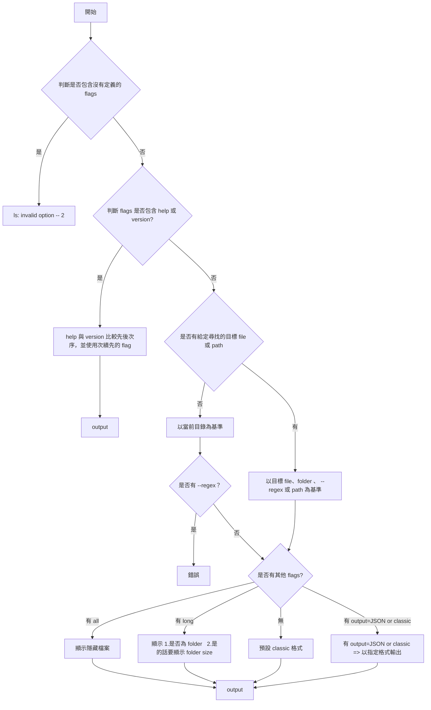

## TECH STACK

- node

<br/>

## 專案架構

```javascript
|-- docs          // 相關文件
|   |-- spec.md
|-- bin
|   |--cli.js     // 入口點，要放在 package.json 中，並引用 index.js
|-- src
|   |-- index.js  // 解析參數、呼叫 core.js、回傳，只處理 I/O
|   |-- core.js   // 核心的呼叫邏輯，會根據 flags 做不同的事情
|   |-- utils
|        |-- ...
|-- package.json
```

<br/>

## 指令

--all

--long

--regex

--output={json|classic}

--help

--version

## 邏輯圖



<br/>

## JSON 格式

```Javascript
// --long=false
[
    {
        name: "foldername", // {string} foldername or filename
        children: [         // 這個 folderpath 第一層的 content
          "subfilename1", "subfoldername1", ...
        ],
  },
  {
      name: "filename",   // {string} filename、foldername
  },
]
```

```Javascript
// --long=true
[
    {
        name: "foldername", //{string} foldername or filename
        isDir: true, //{boolean}
        size： 10MB, //{number} 以 mb 為單位

  },
  {
      name: "filename", //{string} foldername or filename
      isDir: false, //{boolean}
  },
]
```

<br/>

## GIVEN WHEN THEN

#### GIVEN：

- `~/Document/exist.txt`
- `~/Document/exist/index.js`
- `~/Document/.hiddenfile.txt`

<br/>
<br/>

[x] 1. 找得到檔案非隱藏的所有檔案

WHEN：my-ls

THEN：
exist.txt exist

<br/>
<br/>

[x] 2. 找得到檔案隱藏的所有檔案

WHEN：my-ls -a

THEN：
exist.txt exist .hiddenfile.txt

<br/>
<br/>

[x] 3. 找不到不存在的檔案

WHEN：my-ls non-exist.txt

THEN：
process.stderr.write 、process.exit(3)

<br/>
<br/>

[x] 4. long args 可以顯示細節

WHEN：my-ls -l

THEN：
exist.txt - isDir=false
exist 10MB isDir=true

<br/>
<br/>

[ ] 5. regex args 可以用 args 搜尋，多個時應該為聯集，且不可重複

WHEN：my-ls e\* -lr

THEN：
exist.txt - isDir=false
exist 20MB. isDir=true

<br/> 
<br/>

[ ] 6. regex args 找不到不相符的檔案

WHEN：my-ls m\*.mp3 --regex

THEN：
process.stderr.write 、process.exit(3)

<br/>
<br/>

[ ] 7. help args 可以看內容

WHEN：my-ls -la -h -v

THEN：help 內容

<br/>
<br/>

[x] 8. version args 可以看版本號

WHEN：my-ls -la -v -h

THEN：version

<br/> 
<br/>

[x] 9. long all args 可以合併使用

WHEN：my-ls -la

THEN：
exist.txt - isDir=false
exist 10MB. isDir=true
.hddenfile.txt - isDir=false

<br/> 
<br/>

[x] 10. 可以搜尋多個指定目標，若為 directory 要列出第一層子層的內容

WHEN：my-ls exist.txt exist

THEN：（資料夾會列出第一層裡面的內容，參考 ls）
exist.txt

exist:
index.js

<br/>
<br/>

[x] 11. 可子指定 output args = classic | json，預設為 classic，後面會覆蓋前面

WHEN：my-ls exist.txt --output=json --output=classic

THEN：後面會覆蓋前面的（參考 ls）、格式參考上述

<br/>
<br/>

[x] 12. 可以找 path、多個 path，檔名就好
WHEN：my-ls exist/index.js

THEN：要可以找 path(參考 ls)、
index.js

<br/>
<br/>

[x] 13. args 與 positionals 不受先後順序影響

WHEN：my-ls --regex -l e\*

THEN：不受 args 和 flag 先後順序影響
exist.txt - isDir=false
exist 20MB. isDir=true

<br/>
<br/>

[x] 14.不合法的 args，exit(1)

WHEN：my-ls --123

THEN：
process.stderr.write(Unknown option) 、process.exit(1)

<br/> 
<br/>

[x] 15. args 一個合法一個不合法，exit(1)

WHEN：my-ls -1a

THEN：
process.stderr.write(Unknown option) 、process.exit(1)

<br/> 
<br/>

[x] 16. 一個找得到一個找不到，找到的要列出來、找不到的要 exit(3)

WHEN：my-ls non-exist exist.txt

THEN：
process.stderr.write("") 、process.stderr.write 、process.exit(3)

exist

<br/> 
<br/>

[x] 17. position 和 regex 同時存在

WHEN：my-ls --regex file

THEN：
process.stderr.write("Command-line usage error") 、process.stderr.write 、process.exit(64)

<br/> 
<br/>

[ ] 18. glob

WHEN：

THEN：

<br/> 
<br/>

[x] 19. 可以全域使用 my-ls

[x] a. npm link

[ ] b. export PATH=$PATH:{資料夾路徑}

<br/> 
<br/>

[ ] 20. shell script 測試

WHEN：

THEN：

<br/> 
<br/>

[ ] 21. 重構、架構

WHEN：

THEN：

<br/> 
<br/>

[ ] 22. man

WHEN：

THEN：

<br/> 
<br/>

[x] 23. 細節統整

isDir:
size:
mtime:
mode:
isSymbolicLink:

<br/> 
<br/>

[x] 24. help 和 version 同時出現的話，會顯示優先次序前面的

<br/> 
<br/>

[ ] 25. 全域用參數

<br/> 
<br/>
