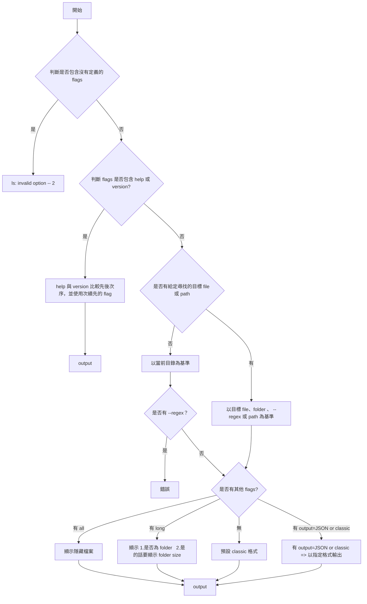

## TECH STACK

- node

<br/>

## 專案架構 TODO

```javascript
|-- docs          // 相關文件
|   |-- spec.md
|-- bin
|   |--cli.js     // 入口點，要放在 package.json 中，並引用 index.js
|-- src
|   |-- index.js  // 解析參數、呼叫 core.js、回傳，只處理 I/O
|   |-- core.js   // 核心的呼叫邏輯，會根據 flags 做不同的事情
|   |-- utils
|        |-- ...
|-- package.json
```

<br/>

## 指令

--all

--long

--regex

--output={json|classic}

--help

--version

## 邏輯圖



<br/>

## JSON 格式

```Javascript
// --long=false
[
    {
        name: "foldername", // {string} foldername or filename
        children: [         // 這個 folderpath 第一層的 content
          "subfilename1", "subfoldername1", ...
        ],
  },
  {
      name: "filename",   // {string} filename、foldername
  },
]
```

```Javascript
// --long=true
[
    {
        name: "foldername", //{string} foldername or filename
        isDir: true, //{boolean}
        size： 10MB, //{number} 以 mb 為單位

  },
  {
      name: "filename", //{string} foldername or filename
      isDir: false, //{boolean}
  },
]
```

<br/>

## GIVEN WHEN THEN

#### GIVEN：

- `~/Document/exist.txt`
- `~/Document/exist/index.js`
- `~/Document/.hiddenfile.txt`
- `~/Document/example.txt`
- `~/Document/app.js`
- `~/Document/src/config.js`
- `~/Document/src/utils/helper.txt`
- `~/Document/test/data.txt`
- `~/Document/.hiddenfolder/.hiddenfile-inside.txt`
- `~/Document/.hiddenfolder/visible.txt`
- `~/Document/.hiddenfolder/.hidden-subfolder/subfile.txt`

<br/>
<br/>

搭配多種模式

a. 使用全域 cli
b. 使用 file 直接下 cli

a. 相對路徑
b. 絕對路徑

<br/>
<br/>

[x] 1. 無參數

WHEN：my-ls

THEN：
exist.txt
exist
(不包含隱藏檔案)

<br/>
<br/>

[x] 2. --all

WHEN：my-ls --all

THEN：
exist.txt
exist
.hiddenfile.txt
(包含隱藏檔案)

<br/>
<br/>

[x] 3. --long（用 JSON 驗證鍵名）

WHEN：my-ls --long --output=json

THEN：
JSON 格式輸出，包含 "isDir" 鍵

<br/>
<br/>

[x] 4. output=json

WHEN：my-ls --output=json

THEN：
JSON 格式輸出（以 [ 開頭）

<br/>
<br/>

[x] 5. 指定多目標（檔案 + 目錄），目錄列第一層

WHEN：my-ls exist.txt exist

THEN：
exist.txt

exist:
index.js
(目錄列出第一層內容)

<br/>
<br/>

[x] 6. 單一檔案（相對/絕對）

WHEN：my-ls exist/index.js

THEN：
index.js

<br/>
<br/>

[x] 7. 找不到的檔案（混合：一個存在一個不存在），應 exit 3

WHEN：my-ls non-exist exist.txt

THEN：
process.stderr.write (No such file or directory) 、process.exit(3)
exist.txt (正常輸出)

<br/>
<br/>

[x] 8. 不合法的 flag，exit=1

WHEN：my-ls --123

THEN：
process.stderr.write (Unknown option) 、process.exit(1)

<br/>
<br/>

[x] 9. help/version 先後順序（不驗證順序內容，只驗證能執行）

WHEN：my-ls -h -v

THEN：
顯示 help 內容

WHEN：my-ls -v -h

THEN：
顯示 version 或 help（根據先後順序）

<br/>
<br/>

[x] 10. flags 與位置參數先後無關（使用 f1，JSON 驗證）

WHEN：my-ls --long --output=json exist.txt

THEN：
JSON 格式輸出，包含 "isDir" 鍵

<br/>
<br/>

[x] 11. output 覆蓋（最後一個生效）

WHEN：my-ls --output=json --output=classic

THEN：
classic 格式輸出（不是 JSON 格式）

<br/>
<br/>

[x] 12. regex args 可以用 args 搜尋，多個時應該為聯集，且不可重複

WHEN：my-ls --regex 'e\*' --long

THEN：
exist.txt (isDir=false)
exist (isDir=true)
(包含 isDir 資訊)

<br/> 
<br/>

[x] 13. regex - 當前目錄 .txt 檔

WHEN：my-ls --regex '^[^/]\*\.txt$'

THEN：
exist.txt
example.txt
(不包含子資料夾中的 helper.txt)

<br/> 
<br/>

[x] 14. regex - 遞迴搜尋所有 .txt

WHEN：my-ls --regex '^.\*\.txt$'

THEN：
exist.txt
example.txt
helper.txt
data.txt
(包含所有層級的 .txt 檔案)

<br/> 
<br/>

[x] 15. regex - 多個 patterns 聯集

WHEN：my-ls --regex '^[^/]\*\.txt$' '^app\.js$'

THEN：
exist.txt
example.txt
app.js
(多個 patterns 的聯集結果)

<br/> 
<br/>

[x] 15a. regex - 多個 patterns 去重（同一個檔案被多個 pattern 匹配）

WHEN：my-ls --regex '^exist\.txt$' '^.*\.txt$'

THEN：
exist.txt (只出現一次)
example.txt
helper.txt
data.txt
(同一個檔案被多個 pattern 匹配時應該只出現一次)

<br/> 
<br/>

[x] 16. regex - 匹配目錄

WHEN：my-ls --regex '^src$'

THEN：
src:
config.js
utils
(匹配到目錄時列出第一層內容)

<br/> 
<br/>

[x] 17. regex - 無效 pattern

WHEN：my-ls --regex '\*'

THEN：
process.stderr.write (Invalid regular expression) 、process.exit(3)

<br/> 
<br/>

[x] 18. regex - 部分無效 patterns

WHEN：my-ls --regex '^exist\.txt$' '\*'

THEN：
exist.txt (正常輸出)
process.stderr.write (Invalid regular expression) 、process.exit(3)

<br/> 
<br/>

[x] 19. regex - 匹配隱藏資料夾（. 開頭）

WHEN：my-ls --regex '^\.hiddenfolder$'

THEN：
visible.txt
(匹配到 .hiddenfolder 資料夾，列出第一層內容，只顯示非隱藏檔案)

<br/> 
<br/>

[x] 20. regex - 匹配隱藏資料夾中的第一層檔案

WHEN：my-ls --regex '^\.hiddenfolder/[^/]\*\.txt$'

THEN：
.hiddenfolder/visible.txt
.hiddenfolder/.hiddenfile-inside.txt
(不包含子資料夾中的檔案)

<br/> 
<br/>

[x] 21. regex - 匹配隱藏資料夾中的所有檔案（包括子資料夾，遞迴）

WHEN：my-ls --regex '^\.hiddenfolder/.\*\.txt$'

THEN：
.hiddenfolder/visible.txt
.hiddenfolder/.hiddenfile-inside.txt
.hiddenfolder/.hidden-subfolder/subfile.txt
(包含所有層級的檔案)

<br/> 
<br/>

[x] 22. regex - 匹配資料夾中的隱藏檔案（要求有 /）

WHEN：my-ls --regex '^._/\.hidden._\.txt$'

THEN：
.hiddenfolder/.hiddenfile-inside.txt
(不包含根目錄的 .hiddenfile.txt，因為沒有 /)

<br/> 
<br/>

[x] 23. regex - 匹配當前目錄的隱藏檔案

WHEN：my-ls --regex '^\.hiddenfile\.txt$'

THEN：
.hiddenfile.txt

<br/> 
<br/>

[x] 24. regex - 合法 pattern 但沒有匹配到任何檔案

WHEN：my-ls --regex '^nonexistent\.mp3$'

THEN：
process.stderr.write (No such file or directory) 、process.exit(3)

<br/> 
<br/>

[x] 25. regex - 多個 patterns 部分沒匹配到

WHEN：my-ls --regex '^exist\.txt$' '^nonexistent\.mp3$'

THEN：
exist.txt (正常輸出)
process.stderr.write (No such file or directory) 、process.exit(3)

<br/>
<br/>
