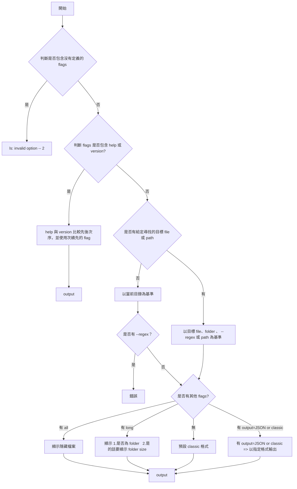

## TECH STACK
- node
- json-colorizer
- yargs
- mock-fs


<br/>

## 專案架構

```javascript
|-- docs          // 相關文件
|   |-- spec.md
|-- bin
|   |--cli.js     // 入口點，要放在 package.json 中，並引用 index.js
|-- src
|   |-- index.js  // 解析參數、呼叫 core.js、回傳，只處理 I/O
|   |-- core.js   // 核心的呼叫邏輯，會根據 flags 做不同的事情
|   |-- utils
|        |-- ...
|   |-- constants
|        |-- ..
| -- test
|-- package.json
```

<br/>


## 指令

--all

--long

--regex

--output={json|classic}

--help

--version

## 邏輯圖


<br/>

## JSON 格式
```Javascript
// --long=false
[
    {
        name: "foldername", // {string} foldername or filename
    children: [         // 這個 folderpath 第一層的 content
      "subfilename1", "subfoldername1", ...
    ], 
  },
  {
      name: "filename",   // {string} filename、foldername 
  },
]
```

```Javascript
// --long=true
[
    {
        name: "foldername", //{string} foldername or filename
    isDir: true, //{boolean}
    size： 10MB, //{number} 以 mb 為單位
    
  },
  {
      name: "filename", //{string} foldername or filename
    isDir: false, //{boolean}
  },
]
```


<br/>

## GIVEN WHEN THEN
#### GIVEN：
- `~/Document/exist.txt`
- `~/Document/exist/index.js`
- `~/Document/.hiddenfile.txt`

<br/>
<br/>


WHEN：my-ls

THEN：
exist.txt      exist      

<br/>
<br/>

WHEN：my-ls -a

THEN：
exist.txt       exist       .hiddenfile.txt

<br/>
<br/>

WHEN：my-ls non-exist.txt

THEN：
process.stderr.write 、process.exit(3)

<br/>
<br/>

WHEN：my-ls -l

THEN：
exist.txt       -        isDir=false
exist        10MB     isDir=true


<br/>
<br/>

WHEN：my-ls m*.mp3 --regex

THEN：
process.stderr.write 、process.exit(3)

<br/>
<br/>


WHEN：my-ls e* -lr

THEN：
exist.txt              -             isDir=false
exist                  20MB.     isDir=true

<br/> 
<br/> 

WHEN：my-ls -la -h -v

THEN：help 內容

<br/>
<br/>

WHEN：my-ls -la -v -h

THEN：version

<br/> 
<br/> 

WHEN：my-ls -la 

THEN：
exist.txt              -             isDir=false
exist                   10MB.     isDir=true
.hddenfile.txt        -           isDir=false

<br/> 
<br/> 

WHEN：my-ls exist.txt .hiddenexist.txt -a

THEN：
.hddenfile.txt
exist.txt 

<br/> 
<br/> 

WHEN：my-ls exist.txt exist

THEN：（資料夾會列出第一層裡面的內容，參考 ls）
exist.txt 

exist:
index.js

<br/>
<br/>

WHEN：my-ls exist.txt --output=json --output=classic

THEN：後面會覆蓋前面的（參考 ls）

<br/>
<br/>

WHEN：--output=json

THEN：看上面的 json 範例

<br/>
<br/>

WHEN：my-ls exist/index.js

THEN：要可以找 path(參考 ls)
exist/index.js

<br/>
<br/>

WHEN：my-ls --regex -l e*

THEN：不受 args 和 flag 先後順序影響
exist.txt              -             isDir=false
exist                  20MB.     isDir=true


<br/>
<br/>

WHEN：my-ls --123

THEN：(參考 ls)
ls: -123: No such file or directory

<br/> 
<br/> 

WHEN：my-ls exist/index.js

THEN：要可以找 path(參考 ls)
index.js


<br/> 
<br/> 
