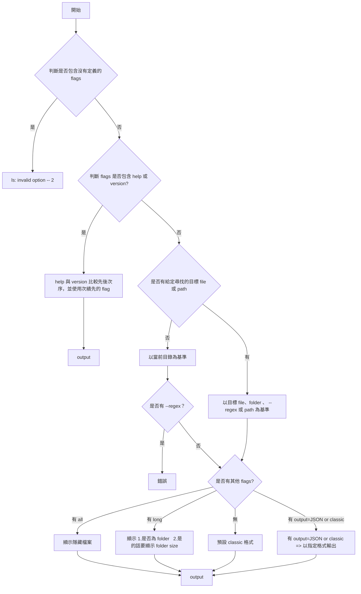

## TECH STACK

- node

<br/>

## 專案架構

```javascript
|-- docs                          // 相關文件
|   |-- spec.md
|-- bin
|   |-- cli.js                    // 入口點，要放在 package.json 中，並引用 index.js
|-- src
|   |-- index.js                  // 解析參數、呼叫 services、處理 I/O
|   |-- constants/
|   |   |-- config.js             // 配置常數（ARGS, OPTIONS, OUTPUT_OPTIONS）
|   |-- services/
|   |   |-- help-and-version-service.js  // Help 和 Version 輸出服務
|   |   |-- output-service.js            // 檔案輸出服務
|   |   |-- reader/
|   |   |   |-- index.js                 // 根據參數選擇 Reader
|   |   |   |-- base-reader-service.js   // BaseReader - 共用的一些 function 在這裡
|   |   |   |-- path-reader-service.js   // PathReader - 讀取指定路徑
|   |   |   |-- regex-reader-service.js  // RegexReader - 用 regex 匹配檔案
|   |   |   |-- directory-reader-service.js  // DirectoryReader - 讀取當前目錄
|   |-- utils/
|   |   |-- error.js              // error 相關 utils
|   |   |-- file.js               // 檔案相關 utils
|-- test/
|   |-- main.sh                   // E2E 測試腳本
|-- package.json
```

<br/>

## 指令

--all

--long

--regex

--output={json|classic}

--help

--version

## 邏輯圖



<br/>

## JSON 格式

```Javascript
// --long=false
[
    {
        name: "foldername", // {string} foldername or filename
        children: [         // 這個 folderpath 第一層的 content
          "subfilename1", "subfoldername1", ...
        ],
  },
  {
      name: "filename",   // {string} filename、foldername
  },
]
```

```Javascript
// --long=true
[
    {
        name: "foldername", //{string} foldername or filename
        isDir: true, //{boolean}
        size： 10MB, //{number} 以 mb 為單位

  },
  {
      name: "filename", //{string} foldername or filename
      isDir: false, //{boolean}
  },
]
```

<br/>

## GIVEN WHEN THEN

#### GIVEN：

- `~/Document/exist.txt`
- `~/Document/exist/index.js`
- `~/Document/.hiddenfile.txt`
- `~/Document/example.txt`
- `~/Document/app.js`
- `~/Document/src/config.js`
- `~/Document/src/utils/helper.txt`
- `~/Document/test/data.txt`
- `~/Document/.hiddenfolder/.hiddenfile-inside.txt`
- `~/Document/.hiddenfolder/visible.txt`
- `~/Document/.hiddenfolder/.hidden-subfolder/subfile.txt`
- `~/Document/exist/exist/exist.js`
- `~/Document/exist/exist/non/exist.js`

<br/>
<br/>

搭配多種模式

a. 使用全域 cli
b. 使用 file 直接下 cli

a. 相對路徑
b. 絕對路徑

<br/>
<br/>

[x] 1. 無參數

WHEN：my-ls

THEN：
exist.txt
exist
(不包含隱藏檔案)

<br/>
<br/>

[x] 2. --all

WHEN：my-ls --all

THEN：
exist.txt
exist
.hiddenfile.txt
(包含隱藏檔案)

<br/>
<br/>

[x] 3. --long（用 JSON 驗證鍵名）

WHEN：my-ls --long --output=json

THEN：
JSON 格式輸出，包含 "isDir" 鍵

<br/>
<br/>

[x] 4. output=json

WHEN：my-ls --output=json

THEN：
JSON 格式輸出（以 [ 開頭）

<br/>
<br/>

[x] 5. 指定多目標（檔案 + 目錄），目錄列第一層

WHEN：my-ls exist.txt exist

THEN：
exist.txt

exist:
index.js
(目錄列出第一層內容)

<br/>
<br/>

[x] 6. 單一檔案（相對/絕對）

WHEN：my-ls exist/index.js

THEN：
index.js

<br/>
<br/>

[x] 7. 找不到的檔案（混合：一個存在一個不存在），應 exit 3

WHEN：my-ls non-exist exist.txt

THEN：
process.stderr.write (No such file or directory) 、process.exit(3)
exist.txt (正常輸出)

<br/>
<br/>

[x] 8. 不合法的 flag，exit=1

WHEN：my-ls --123

THEN：
process.stderr.write (Unknown option) 、process.exit(1)

<br/>
<br/>

[x] 9. help/version 先後順序（不驗證順序內容，只驗證能執行）

WHEN：my-ls -h -v

THEN：
顯示 help 內容

WHEN：my-ls -v -h

THEN：
顯示 version 或 help（根據先後順序）

<br/>
<br/>

[x] 10. flags 與位置參數先後無關（使用 f1，JSON 驗證）

WHEN：my-ls --long --output=json exist.txt

THEN：
JSON 格式輸出，包含 "isDir" 鍵

<br/>
<br/>

[x] 11. output 覆蓋（最後一個生效）

WHEN：my-ls --output=json --output=classic

THEN：
classic 格式輸出（不是 JSON 格式）

<br/>
<br/>

## Regex Reader 過濾邏輯

### 核心邏輯

當使用 `--regex` 參數時，RegexReader 會匹配所有符合 pattern 的路徑。為了避免重複輸出，實現了**智能過濾邏輯**：

**過濾規則**：

1. **直接父目錄過濾**：

   - 如果路徑的**直接父目錄**被匹配，且直接父目錄**不會被過濾** → **過濾掉**（無論文件還是目錄，因為直接子項會在父目錄的輸出中顯示）
   - 如果路徑的**直接父目錄**被匹配，但直接父目錄**會被過濾** → 繼續後續邏輯

2. **更深層路徑過濾**：

   - 如果路徑的**祖先目錄**也被匹配（非直接父目錄），且當前路徑是**目錄** → **過濾掉**（因為父目錄會顯示子內容）
   - 如果路徑的**祖先目錄**也被匹配（非直接父目錄），但當前路徑是**文件** → **保留**（因為文件不會顯示子內容）

3. **無匹配祖先**：
   - 如果路徑的**祖先目錄**未被匹配 → **保留**

### 實現細節

1. **獲取祖先目錄**：對於每個匹配的路徑，使用 `getAncestors()` 方法獲取所有祖先目錄路徑

   - 例如：`exist/exist/exist.js` 的祖先是 `["exist/exist", "exist"]`
   - 例如：`exist` 的祖先是 `[]`（沒有祖先）

2. **檢查直接父目錄**：

   - 獲取直接父目錄（`ancestors[0]`）
   - 如果直接父目錄被匹配，檢查直接父目錄是否會被過濾（檢查直接父目錄的祖先）
   - 如果直接父目錄不會被過濾，直接過濾掉當前路徑（無論文件還是目錄）

3. **檢查更深層祖先**：如果直接父目錄會被過濾，繼續檢查是否有其他祖先被匹配

   - 使用 `Set` 進行 O(1) 時間複雜度的查找

4. **判斷類型**：使用 `fs.stat()` 判斷路徑是文件還是目錄

   - 只有當路徑有匹配的祖先且直接父目錄會被過濾時，才需要獲取 stat 信息
   - 使用 `statCache` 緩存 stat 結果，避免重複 I/O 操作

5. **性能優化**：

   - 使用 `Set` 存儲匹配結果，快速查找
   - 使用 `Map` 緩存 stat 結果，避免對同一路徑重複調用 `fs.stat()`

6. **錯誤處理**：
   - 如果無法獲取 stat（例如文件不存在、權限不足、競態條件等），跳過過濾
   - 將該路徑保留在結果中，讓後續的 `readPath` 統一處理錯誤
   - 這樣可以確保錯誤處理的一致性，不會因為過濾階段無法獲取 stat 就誤刪路徑

### 無法獲取 stat 的情況

以下情況可能導致 `fs.stat()` 失敗：

- **文件/目錄不存在**：在掃描和過濾之間，文件被刪除或移動（競態條件）
- **權限不足**：沒有讀取權限的文件或目錄
- **符號連結損壞**：符號連結指向不存在的目標
- **其他文件系統錯誤**：磁盤錯誤、網絡文件系統問題等

當遇到這些情況時，過濾邏輯會保留該路徑，讓後續的 `readPath` 統一處理錯誤，確保錯誤信息的一致性和準確性。

### 範例

**結構**：

```
exist/
  exist/
    exist.js
    non/
      exist.js
```

**Pattern**: `exist`

**匹配結果**：

- `exist` (目錄)
- `exist/index.js` (文件)
- `exist/exist` (目錄)
- `exist/exist/exist.js` (文件)
- `exist/exist/non` (目錄)
- `exist/exist/non/exist.js` (文件)

**過濾過程**：

1. `exist` → 無匹配祖先 → **保留**
2. `exist/index.js` → 直接父目錄 `exist` 被匹配，且 `exist` 不會被過濾 → **過濾**（因為會在 `exist:` 輸出中顯示）
3. `exist/exist` → 直接父目錄 `exist` 被匹配，且 `exist` 不會被過濾 → **過濾**（因為會在 `exist:` 輸出中顯示）
4. `exist/exist/exist.js` → 直接父目錄 `exist/exist` 被匹配，但 `exist/exist` 會被過濾（因為 `exist` 是它的祖先）→ 繼續後續邏輯，是文件 → **保留**
5. `exist/exist/non` → 直接父目錄 `exist/exist` 被匹配，但 `exist/exist` 會被過濾 → 繼續後續邏輯，是目錄 → **過濾**
6. `exist/exist/non/exist.js` → 直接父目錄 `exist/exist/non` 未被匹配，但祖先 `exist` 被匹配 → 是文件 → **保留**

**最終輸出**：

- `exist:` + 第一層內容（包含 `index.js`、`exist` 等）
- `exist/exist/exist.js`
- `exist/exist/non/exist.js`

注意：`exist/index.js` 不會單獨顯示，因為它會在 `exist:` 的輸出中顯示。

### 多個 Patterns 的聯集

當提供多個 patterns 時，過濾邏輯同樣適用：

- 所有 patterns 的匹配結果會先進行**聯集**（去重）
- 然後對聯集結果應用相同的過濾邏輯
- 過濾邏輯不依賴 pattern 的數量或類型，只依賴最終的匹配結果

### 為什麼需要過濾？

當 regex pattern 匹配到目錄時，該目錄的所有子路徑也會被匹配，導致：

- 父目錄會顯示第一層子內容
- 子路徑也會被單獨顯示
- 造成重複輸出

過濾邏輯確保：

- 目錄只顯示一次（父目錄輸出）
- 文件正確顯示（不會被父目錄覆蓋）
- 符合 `ls` 的預期行為

<br/>
<br/>

[x] 12. regex args 可以用 args 搜尋，多個時應該為聯集，且不可重複

WHEN：my-ls --regex 'e\*' --long

THEN：
exist.txt (isDir=false)
exist (isDir=true)
(包含 isDir 資訊)

<br/> 
<br/>

[x] 13. regex - 當前目錄 .txt 檔

WHEN：my-ls --regex '^[^/]\*\.txt$'

THEN：
exist.txt
example.txt
(不包含子資料夾中的 helper.txt)

<br/> 
<br/>

[x] 14. regex - 遞迴搜尋所有 .txt

WHEN：my-ls --regex '^.\*\.txt$'

THEN：
exist.txt
example.txt
helper.txt
data.txt
(包含所有層級的 .txt 檔案)

<br/> 
<br/>

[x] 15. regex - 多個 patterns 聯集

WHEN：my-ls --regex '^[^/]\*\.txt$' '^app\.js$'

THEN：
exist.txt
example.txt
app.js
(多個 patterns 的聯集結果)

<br/> 
<br/>

[x] 15a. regex - 多個 patterns 去重（同一個檔案被多個 pattern 匹配）

WHEN：my-ls --regex '^exist\.txt$' '^.*\.txt$'

THEN：
exist.txt (只出現一次)
example.txt
helper.txt
data.txt
(同一個檔案被多個 pattern 匹配時應該只出現一次)

<br/> 
<br/>

[x] 16. regex - 匹配目錄

WHEN：my-ls --regex '^src$'

THEN：
src:
config.js
utils
(匹配到目錄時列出第一層內容)

<br/> 
<br/>

[x] 17. regex - 無效 pattern

WHEN：my-ls --regex '\*'

THEN：
process.stderr.write (Invalid regular expression) 、process.exit(3)

<br/> 
<br/>

[x] 18. regex - 部分無效 patterns

WHEN：my-ls --regex '^exist\.txt$' '\*'

THEN：
exist.txt (正常輸出)
process.stderr.write (Invalid regular expression) 、process.exit(3)

<br/> 
<br/>

[x] 19. regex - 匹配隱藏資料夾（. 開頭）

WHEN：my-ls --regex '^\.hiddenfolder$'

THEN：
visible.txt
(匹配到 .hiddenfolder 資料夾，列出第一層內容，只顯示非隱藏檔案)

<br/> 
<br/>

[x] 20. regex - 匹配隱藏資料夾中的第一層檔案

WHEN：my-ls --regex '^\.hiddenfolder/[^/]\*\.txt$'

THEN：
.hiddenfolder/visible.txt
.hiddenfolder/.hiddenfile-inside.txt
(不包含子資料夾中的檔案)

<br/> 
<br/>

[x] 21. regex - 匹配隱藏資料夾中的所有檔案（包括子資料夾，遞迴）

WHEN：my-ls --regex '^\.hiddenfolder/.\*\.txt$'

THEN：
.hiddenfolder/visible.txt
.hiddenfolder/.hiddenfile-inside.txt
.hiddenfolder/.hidden-subfolder/subfile.txt
(包含所有層級的檔案)

<br/> 
<br/>

[x] 22. regex - 匹配資料夾中的隱藏檔案（要求有 /）

WHEN：my-ls --regex '^._/\.hidden._\.txt$'

THEN：
.hiddenfolder/.hiddenfile-inside.txt
(不包含根目錄的 .hiddenfile.txt，因為沒有 /)

<br/> 
<br/>

[x] 23. regex - 匹配當前目錄的隱藏檔案

WHEN：my-ls --regex '^\.hiddenfile\.txt$'

THEN：
.hiddenfile.txt

<br/> 
<br/>

[x] 24. regex - 合法 pattern 但沒有匹配到任何檔案

WHEN：my-ls --regex '^nonexistent\.mp3$'

THEN：
process.stderr.write (No such file or directory) 、process.exit(3)

<br/> 
<br/>

[x] 25. regex - 多個 patterns 部分沒匹配到

WHEN：my-ls --regex '^exist\.txt$' '^nonexistent\.mp3$'

THEN：
exist.txt (正常輸出)
process.stderr.write (No such file or directory) 、process.exit(3)

<br/>
<br/>

[x] 26. regex - 過濾被匹配祖先目錄的子目錄（但保留文件）

WHEN：my-ls --regex 'exist'

THEN：
exist:
(目錄的第一層內容，包含 index.js、exist 等)

exist/exist/exist.js
exist/exist/non/exist.js
(嵌套的文件被保留，但嵌套的目錄 exist/exist 和直接子文件 exist/index.js 不會單獨顯示，因為被父目錄 exist 過濾)

<br/>
<br/>

[x] 27. regex - 多個 patterns 聯集的過濾邏輯

WHEN：my-ls --regex 'exist' 'exist\.js'

THEN：
exist:
(目錄的第一層內容，包含 index.js、exist 等)

exist/exist/exist.js
exist/exist/non/exist.js
(多個 patterns 的聯集結果，過濾邏輯與單一 pattern 相同：過濾直接父目錄被匹配且不會被過濾的子項，以及更深層的目錄，但保留更深層的文件)

<br/>
<br/>
